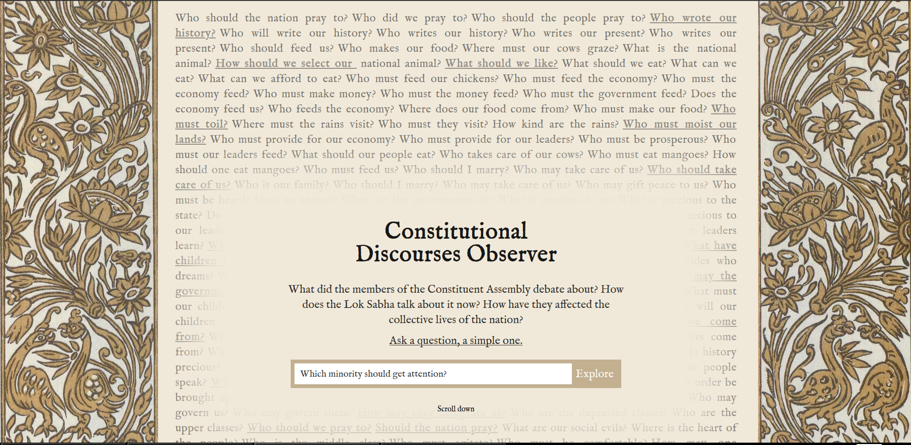
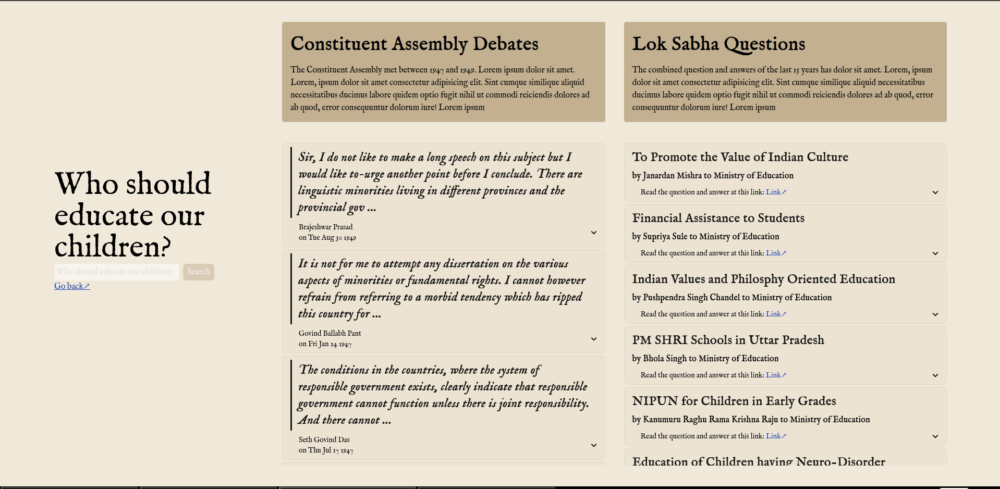

# Building Constitutional Values

Medium: Web platform and Print installation

Adhavan, 2024

How do people, as citizens, question the government? Holding the government accountable is one of the primary parliamentary roles of the opposition. However, as common citizens, we do not know much of how the Parliament functions. The realities of our democracy means there are always people who are ignored, sidelined, pushed, reduced and small-cased. What protects their rights?

Those being marginalised exist across a spectrum. There are grave threats to their lives, and there is a slow erosion of their rights. The erosion may be in many ways: In marriage laws, in their right to drink water, in the lack of food availability or in their right to pray.

How have the makers of the Constitution dealt with these? How does the Parliament deal with it? How do people come together to demand?  This exhibit explores the making of these questions: What should we question? And how best do we begin questioning? The experiences woven into the web-platform allow you to do that — Question more, Question deeply. 

## Abstract for the interface

What are the arguments that have made India a Secular Republic? There are thoughts and arguments that have allowed the creation of what is modern India: They have come from the visions of the leaders of the Freedom struggle, and those who opposed those visions; These have come from those who wrote the Constitution and those who fought to change it. These continue to come from the visions of our elected leaders and from dissidents who fight for rights denied.

This platform will allow for a visitor to question many of these groups, the question will be posed to an available corpus of documented debates and statements. And the most relevant answers (paragraphs relevant to the question) will be presented.

## Technical overview

1. Data from constitutionofindia.net and over 3 Lakh LokSabha questions from the last 15 years have been scraped and cleaned.
2. These questions are then used to create text embeddings that serve as the basis for the semantic search engine.
3. The text embeddings are then used to answer questions.

## Repository Structure

This is a monorepo containing data preparation scripts, frontend and backend code.

1. Data preparation scripts are in the `scripts` folder
   1. `create_embeddings.qmd` contains the code to create text embeddings that serve as the basis of the semantic search engine
   2. `scrape.qmd` contains the code to scrape the data (from multiple sources)
2. `frontend` hosts the Sveltekit frontend
3. `server.py` hosts the Flask server
4. `wsgi.py` hosts the WSGI server start point

## How to develop

1. `cd frontend && yarn run dev ` will start the frontend development server.
2. `python3 server.py` will start a local Flask server on port 5000.

## Roadmap

### Immediate concerns

1. Immersive landing page experience into the Constituent Assembly Debates
2. More interesting and simpler ways to add context to search results

## Data sources and acknowlegements

1. Constituent Assembly Debates have been sourced from the work of [Constitutionofindia.net](https://www.constitutionofindia.net/). The data was conveniently sourced from their site in the required format due to their efforts. Constitution of India is a project by the [Center for Law and Policy Research, Bangalore](https://clpr.org.in).

2. Lok Sabha Questions have been scraped from over 3 lakh PDFs downloaded from [sansad.in](sansad.in) and other sources, made possible by the work of Vonter at the [india-representatives-watch repository](https://github.com/Vonter/india-representatives-activity/). It is distributed under the ODbL lisence. That repository is sourced from [PRS India](https://prsindia.org).
